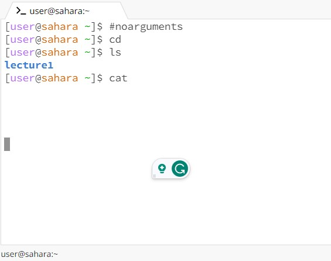
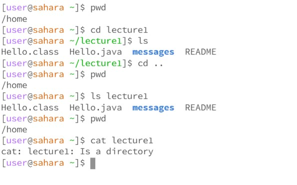
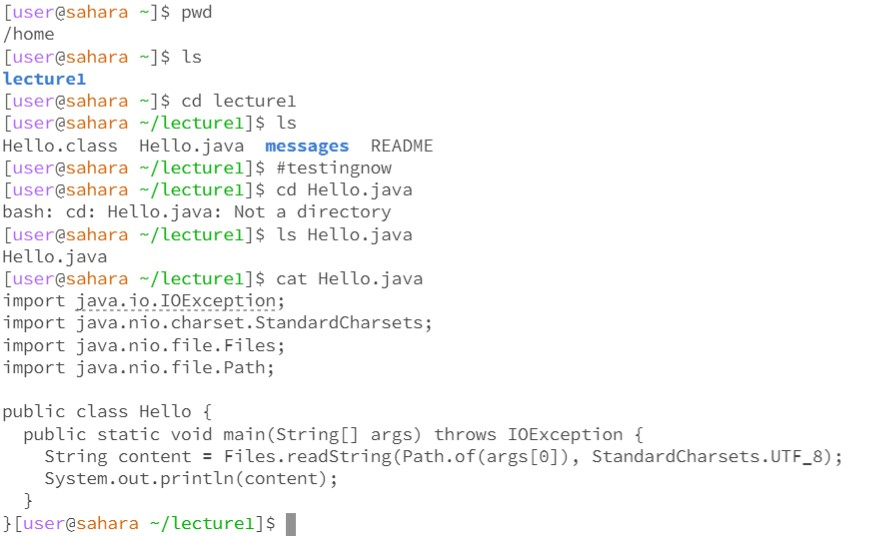

# Lab Report 1 
## By Jason Boenjamin

1. **This is the first step for `cd`, `ls`, and `cat` with no arguments.**  
**The working directory for this problem is "/home"**

* For the first `cd`, it changes the directory to the home directory
  - This is not an error because it can be a stand alone command
* For the first `ls`, it lists all files in the current directory, except for hidden files.
  - This is not an error because it can be a stand alone command
* For the first `cat`, it is supposed to be used to concatenate and print files.
  - This is an ERROR because the terminal did not continue to work after this. I believe the cat command needs to have at least one file name after it.

2. **This is the second step for `cd`, `ls`, and `cat` with a path to a directory as an argument.**
**The working directory for this problem is `/home`**

* For the first `cd`, we change directory into `/lecture1`. The working directory right now is `/home/lecture1`
  - This is not an error because it has a directory to change to.
* For the first `ls` that we are testing, we are back in the home directory so typing `ls lecture1` will list all the files in the lecture 1 directory.
  - This is not an error, since there is a provided directory to list the files from.
* For he first `cat`, we are still in the home directory. When we run `cat lecture1`, it states that `cat: lecture1: Is a directory`
  - This is an ERROR because cat requires a file to list the contents from, not a directory.
  

3. **This is the third step for `cd`, `ls`, and `cat` with a path to a file as an argument.**
**The working directory for this problem is `/home/lecture1`**

* For the first `cd`, we are testing a file. In this case, we are trying to `cd` into `Hello.java` The output that is returned is `bash: cd: Hello.java: Not a directory`.
  
 - This is an ERROR because cd stands for "change directory" meaning that the next object in the command line must be a directory.
   
* For the first `ls` we are trying, it just simple lists the file name given. The command was `ls Hello.java` and what was returned was `Hello.java` on the following line.
  
 - This is not an error because a the given file is listed. (Meaning that it exists in that current directory)

* For the first `cat`, it simply lists all the lines of code in the file given.

 - This is not an error because it simple shows all the lines of code in the given file.

4. asdfasdf
* asdfasdf
  - asdf

