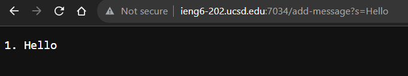
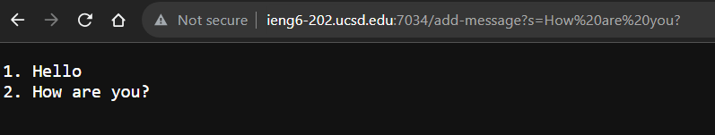
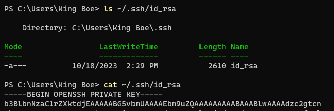
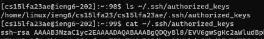
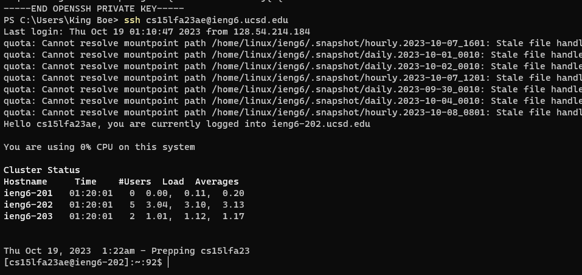

# Lab Report 2
## By Jason Boenjamin
### Part 1
 
This lab report is about Servers and SSH Keys.
 

- This screenshot displays what the user will see when they enter the website.
- [Website Link At The Time](http://ieng-202.ucsd.edu:7034)

- For this first screenshot, we are specifically using `/add-messages?s=Hello`.
 - The methods that are called in my code are  `handleRequest(URI url)`. The outcome of the server depends on what url is placed in. In this case, "Hello" is the query that needs to be added to the website.
 - The server updates and the website now prints `1. Hello`, since "Hello" is the first string entered.

- For this second screenshot, we are specifically using `/add-messages?s=How are you?`.
- Similarly, the methods that are called in my code are `handleRequest(URI url)`. The outcome of the server is, again, changed because the query has changed to add "How are you?", instead of "Hello".
- The server updates and the website now prints `1. Hello\n2. How are you?`, since "How are you?" is added after the previous `/add-message`

 
- The relevant arguments for both screenshots, method `handleRequest(URI url)` is "URL".
 
- The values of url change the request because you can either `/add-messages` or display the starting screen.
 

### Part 2

Using command line to show path to *private* and *public* key.

* The screenshot above shows the path to my *private* key using `ls` and `cat` for verification.
  

* The screenshot above shows the path to my *public* key using `ls` and `cat` for verification.
  

* The screenshot above shows that I can log into ieng6 for this course without being asked for a password

### Part 3
Concluding statements:
I've learned a lot these past two weeks. I finally learned how to connect to my ieng6 account without a password! A week ago, I didn't know where to put my public key for my CS30 ieng6 account. After this lab, I was able to place my public keys for all my personal devices. The convenience is amazing!

