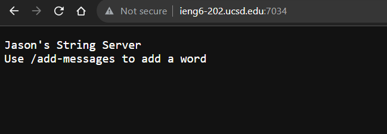

# Lab Report 2
## By Jason Boenjamin

 
This lab report is about Servers and SSH Keys.
 

- This screenshot displays what the user will see when they enter the website.
- [Website Link At The Time](http://ieng-202.ucsd.edu:7034)

/* * For this first screenshot, we are specifically using `/add-messages?s=Hello`
  - The methods that are called in my code are `getPath()`,`.contains()`, `.getQuery()`,  `.split()` and `.equals`. Along with a few string ArrayList methods such as `.add()`, `.size()` and `.get()`  
  - The relevant arguments or values for those methods are:
    -  `"/add-message"` for the `.contains()` method
    -  `"="` for the `.split()` method */

