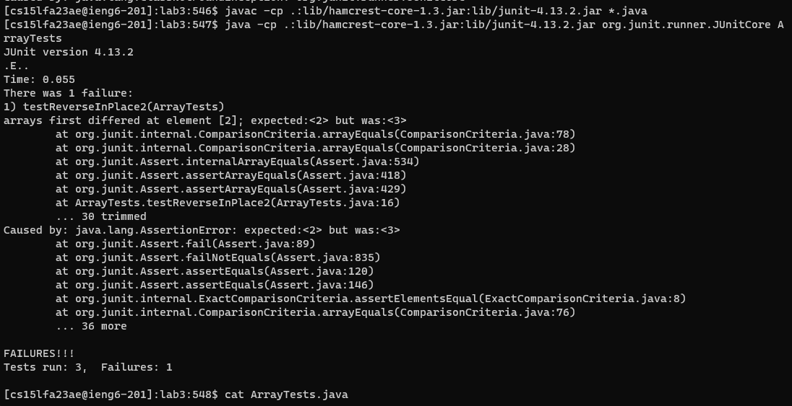
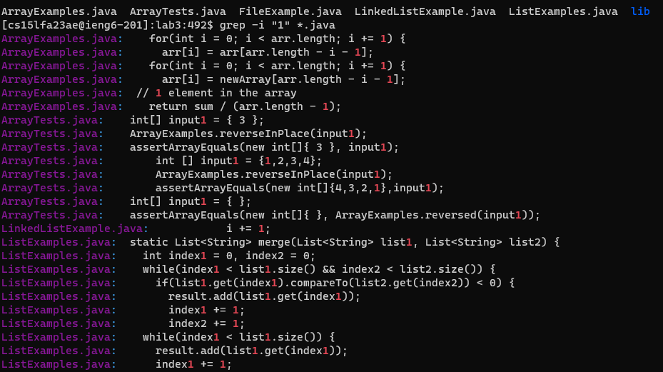

# Lab Report 3
## By Jason Boenjamin
### This lab report is about Bugs and Commands (Week 5)

<br>

### Part 1 - Bugs

<br>

- ***Failure-inducing input for the ArrayExamples buggy program***

```
        @Test
        public void testReverseInPlace2(){
        int [] input1 = {1,2,3,4};
        ArrayExamples.reverseInPlace(input1);
        assertArrayEquals(new int[]{4,3,2,1},input1);
        }
```

- ***Non-failure inducing input***
```
        @Test
        public void testReverseInPlace() {
            int[] input1 = { 3 };
            ArrayExamples.reverseInPlace(input1);
            assertArrayEquals(new int[]{ 3 }, input1);
        }
  @Test
  public void testReversed() {
    int[] input1 = { };
    assertArrayEquals(new int[]{ }, ArrayExamples.reversed(input1));
  }

```

- ***Output (failure inducing input test output and non-failure inducing input test output)***




- ***CODE BEFORE CHANGE***
```
  // Changes the input array to be in reversed order
  static void reverseInPlace(int[] arr) {
    for(int i = 0; i < arr.length; i += 1) {
      arr[i] = arr[arr.length - i - 1];
    }
  }
```

- ***CODE AFTER CHANGE***
```
  // Changes the input array to be in reversed order
  static void reverseInPlace(int[] arr) {
    for(int i = 0; i < arr.length/2; i += 1) {
      int temp = arr[i];
      arr[i] = arr[arr.length-i-1];
      arr[arr.length-i-1] = temp;
    }
  }
```
  

- ***Deescription of change***
The code before the fix would swap from the end to the beginning. The problem is that it wouldn't keep every value because it had already been swapped. To fix this, I needed to use a swap variable called *temp* in order to properly but the array list in reverse order.


<br>

### Part 2 - Researching commands

<br>


- Command 1
```
grep - i "1" *.java
```
  - Looks for every single instance of the given string "1" in all .java files in the current directory.


- Command 2
```
[cs15lfa23ae@ieng6-201]:lab3:493$ grep -c 1 ListExamples.java
11
[cs15lfa23ae@ieng6-201]:lab3:494$
```

