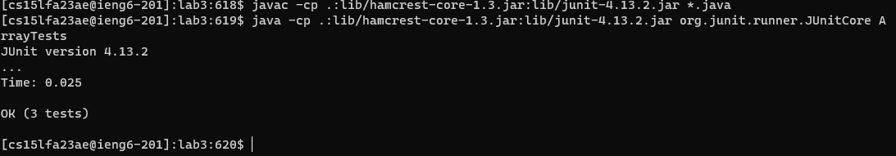

# Lab Report 3
## By Jason Boenjamin
### This lab report is about Bugs and Commands (Week 5)

<br>

### Part 1 - Bugs

<br>

- ***Failure-inducing input for the ArrayExamples buggy program***

```
        @Test
        public void testReverseInPlace2(){
        int [] input1 = {1,2,3,4};
        ArrayExamples.reverseInPlace(input1);
        assertArrayEquals(new int[]{4,3,2,1},input1);
        }
```

- ***Non-failure inducing input***
  
```
        @Test
        public void testReverseInPlace() {
            int[] input1 = { 3 };
            ArrayExamples.reverseInPlace(input1);
            assertArrayEquals(new int[]{ 3 }, input1);
        }

```

- ***Output (failure inducing input test output and non-failure inducing input test output)***


- ***CODE BEFORE CHANGE***
  
```
  // Changes the input array to be in reversed order
  static void reverseInPlace(int[] arr) {
    for(int i = 0; i < arr.length; i += 1) {
      arr[i] = arr[arr.length - i - 1];
    }
  }
```

- ***CODE AFTER CHANGE***

```
  // Changes the input array to be in reversed order
  static void reverseInPlace(int[] arr) {
    for(int i = 0; i < arr.length/2; i += 1) {
      int temp = arr[i];
      arr[i] = arr[arr.length-i-1];
      arr[arr.length-i-1] = temp;
    }
  }
```

- ***Output after code change***
  


- ***Description of change***
The code before the fix would swap from the end to the beginning. The problem is that it wouldn't keep every value because it had already been swapped, this of course is the bug. The symptom is the terminal output we see. Through Junit, we see that the actual output does not match the expected output, until we fix it. To fix this, I needed to use a swap variable called *temp* in order to properly but the array list in reverse order.


<br>

### Part 2 - Researching commands

<br>

The only source I have used is the *man* page when using grep, as it gives an in depth description of `-n`, `-m`, `-c`, `-l`

- ***Command 1, two examples***
  
```
[cs15lfa23ae@ieng6-201]:docsearch:646$ grep -rn "taxes" ./technical/biomed
./technical/biomed/gb-2002-3-9-research0046.txt:42:        data-communication syntaxes for microarray experiments
[cs15lfa23ae@ieng6-201]:docsearch:647$ grep -rn "taxes" ./technical/government
./technical/government/About_LSC/commission_report.txt:861:taxes for H-2A workers. See March Testimony at 157 (testimony of
./technical/government/Gen_Account_Office/Sept14-2002_d011070.txt:1217:additional taxes are being assessed within 5 to 8 months, much
./technical/government/Gen_Account_Office/Statements_Feb28-1997_volume.txt:393:242. Individual income taxes, corporation income taxes, social
./technical/government/Gen_Account_Office/Statements_Feb28-1997_volume.txt:394:insurance taxes and contributions,37 excise taxes, estate and gift
./technical/government/Gen_Account_Office/Statements_Feb28-1997_volume.txt:395:taxes, and customs duties.--Taxes (including customs duties) are
./technical/government/Gen_Account_Office/Statements_Feb28-1997_volume.txt:397:compel payment. In broad terms, taxes are "the price we pay for
./technical/government/Gen_Account_Office/Statements_Feb28-1997_volume.txt:413:243. All excise taxes, like other taxes, are classified as
./technical/government/Gen_Account_Office/Statements_Feb28-1997_volume.txt:414:resulting in nonexchange revenue. Some excise taxes (considered to
./technical/government/Gen_Account_Office/Statements_Feb28-1997_volume.txt:415:be benefit taxes) are levied on bases that are related to the use
./technical/government/Gen_Account_Office/Statements_Feb28-1997_volume.txt:418:taxes are levied on bases related to a cause of some damage and are
./technical/government/Gen_Account_Office/Statements_Feb28-1997_volume.txt:423:indirect and disproportionate. Moreover, these excise taxes, like
./technical/government/Gen_Account_Office/Statements_Feb28-1997_volume.txt:424:other taxes, are determined through the exercise of the power of
./technical/government/Gen_Account_Office/Statements_Feb28-1997_volume.txt:425:the Government to compel payment. Therefore, like other taxes, they
./technical/government/Gen_Account_Office/Statements_Feb28-1997_volume.txt:432:insurance taxes, like other taxes, are determined through the
./technical/government/Gen_Account_Office/Statements_Feb28-1997_volume.txt:435:taxes are subject to them as a byproduct of their decision to enter
./technical/government/Gen_Account_Office/Statements_Feb28-1997_volume.txt:441:other retirement plans. "Social insurance" taxes and contributions
./technical/government/Gen_Account_Office/Statements_Feb28-1997_volume.txt:462:246. Social insurance taxes and contributions paid by Federal
./technical/government/Gen_Account_Office/Statements_Feb28-1997_volume.txt:466:The payments made by Federal employees are in the nature of taxes,
./technical/government/Gen_Account_Office/Statements_Feb28-1997_volume.txt:494:taxes, the system of benefits, and the trust fund--was established
./technical/government/Gen_Account_Office/Statements_Feb28-1997_volume.txt:525:other taxes and duties. It is an ad valorem tax of 0.125 percent
./technical/government/Gen_Account_Office/Statements_Feb28-1997_volume.txt:529:excise taxes that result from the Government's power to compel
./technical/government/Gen_Account_Office/Statements_Feb28-1997_volume.txt:566:dedicated taxes that are also related in the aggregate to
./technical/government/Gen_Account_Office/Statements_Feb28-1997_volume.txt:585:taxes, which are nonexchange revenue, and to enforce laws. Only to
./technical/government/Gen_Account_Office/Statements_Feb28-1997_volume.txt:658:263. Penalties due to delinquent taxes in connection with
./technical/government/Gen_Account_Office/Statements_Feb28-1997_volume.txt:660:penalty on delinquent taxes does not receive anything in exchange,
./technical/government/Gen_Account_Office/Statements_Feb28-1997_volume.txt:663:Penalties on delinquent taxes are therefore a nonexchange revenue.
./technical/government/Gen_Account_Office/Statements_Feb28-1997_volume.txt:864:281. Interest on delinquent taxes and other receivables that
./technical/government/Gen_Account_Office/Statements_Feb28-1997_volume.txt:1158:predominantly from the funds' earmarkedtaxes, which are
./technical/government/Gen_Account_Office/Statements_Feb28-1997_volume.txt:1159:nonexchange transactions with the public (e.g., employment taxes
./technical/government/Gen_Account_Office/Statements_Feb28-1997_volume.txt:1160:and gasoline taxes), and to a lesser extent from other financing
./technical/government/Gen_Account_Office/Statements_Feb28-1997_volume.txt:1207:the nature of taxes; i.e., compulsory payments demanded by the
./technical/government/Gen_Account_Office/Statements_Feb28-1997_volume.txt:1536:not a transfer of earmarked taxes or other income. It does not
./technical/government/Gen_Account_Office/Statements_Feb28-1997_volume.txt:1580:covered by OASDHI and (b) the payroll taxes that the OASDHI trust
./technical/government/Gen_Account_Office/Statements_Feb28-1997_volume.txt:1582:by OASDHI. If benefits would have exceeded taxes, the OASDHI trust
./technical/government/Gen_Account_Office/Statements_Feb28-1997_volume.txt:1925:penalties (578) Forfeitures (578) Individual income taxes,
./technical/government/Gen_Account_Office/Statements_Feb28-1997_volume.txt:1926:corporation income taxes, social insurance taxes and contributions,
./technical/government/Gen_Account_Office/Statements_Feb28-1997_volume.txt:1928:taxes, estate and gift taxes, and customs duties (574)
./technical/government/Gen_Account_Office/Statements_Feb28-1997_volume.txt:1932:Interest on delinquent taxes and other receivables that arise as a
./technical/government/Gen_Account_Office/Statements_Feb28-1997_volume.txt:1944:guarantees (598) Penalties due to delinquent taxes in connection
./technical/government/Gen_Account_Office/Statements_Feb28-1997_volume.txt:1980:Social insurance taxes and contributions paid by Federal
./technical/government/Gen_Account_Office/Statements_Feb28-1997_volume.txt:3768:by major source (e.g., individual income
 taxes, social insurance
./technical/government/Gen_Account_Office/Statements_Feb28-1997_volume.txt:3769:taxes, etc.);
./technical/government/Gen_Account_Office/Statements_Feb28-1997_volume.txt:4933:in connection with taxes, as used in this Statement assessments
./technical/government/Gen_Account_Office/Statements_Feb28-1997_volume.txt:5200:DEDICATED COLLECTIONS (OR TAXES) - See "earmarked taxes."
./technical/government/Gen_Account_Office/Statements_Feb28-1997_volume.txt:5322:taxes incurred for leased property, whether paid by the lessor or
./technical/government/Gen_Account_Office/Statements_Feb28-1997_volume.txt:5408:individual and corporation income taxes and social insurance taxes
./technical/government/Gen_Account_Office/Statements_Feb28-1997_volume.txt:5409:but also include excise taxes, compulsory user charges, customs
./technical/government/Gen_Account_Office/Statements_Feb28-1997_volume.txt:5615:inflows that it demands include taxes, duties, fines, and
./technical/government/Gen_Account_Office/Statements_Feb28-1997_volume.txt:5913:compulsory earmarked taxes and also, in certain cases, general
./technical/government/Gen_Account_Office/Statements_Feb28-1997_volume.txt:5988:TAX GAP - An estimate of taxes (including duties) that are
./technical/government/Gen_Account_Office/d01376g.txt:1798:and paying taxes.
./technical/government/Gen_Account_Office/d01591sp.txt:468:by 2030, there will be only about 2 workers paying taxes to support
./technical/government/Gen_Account_Office/d01591sp.txt:704:what is left over from personal income after taxes and personal
./technical/government/Gen_Account_Office/d01591sp.txt:707:state, and local taxes as well as Social Security and Medicare
./technical/government/Gen_Account_Office/d01591sp.txt:708:payroll taxes are paid. The NIPA personal saving rate is calculated
./technical/government/Gen_Account_Office/d01591sp.txt:747:realized gains do not count as personal income, but any taxe paid
./technical/government/Gen_Account_Office/d01591sp.txt:755:taxes and personal spending, FFA measures saving as the net
./technical/government/Gen_Account_Office/d01591sp.txt:968:inflation and taxes.13
./technical/government/Gen_Account_Office/d01591sp.txt:1256:realized gains do not count as personal income, but any taxes paid
./technical/government/Gen_Account_Office/d01591sp.txt:1324:Family income before taxes
./technical/government/Gen_Account_Office/d01591sp.txt:1331:cash income before taxes for the calendar year preceding the
./technical/government/Gen_Account_Office/d01591sp.txt:1396:sources-before taxes and Medicare premiums. This retirement income
./technical/government/Gen_Account_Office/d01591sp.txt:1445:Social Security taxes, other taxes, or working expenses that will
./technical/government/Gen_Account_Office/d01591sp.txt:1614:relatively fewer workers to pay taxes to finance Social Security
./technical/government/Gen_Account_Office/d01591sp.txt:1633:that payroll taxes of current workers are used to pay retirement,
./technical/government/Gen_Account_Office/d01591sp.txt:1635:Security now collects more in payroll taxes than it pays in
./technical/government/Gen_Account_Office/d01591sp.txt:1675:taxes. As shown in figure 1.9, Medicare's HI trust fund faces cash
./technical/government/Gen_Account_Office/d01591sp.txt:1721:other taxes, or reducing spending for other programs.44
./technical/government/Gen_Account_Office/d01591sp.txt:1758:more payroll taxes to finance Social Security and Medicare. With an
./technical/government/Gen_Account_Office/d01591sp.txt:1957:businesses after paying taxes and dividends. These retained
./technical/government/Gen_Account_Office/d01591sp.txt:3010:through higher taxes, those higher taxes reduce households'
./technical/government/Gen_Account_Office/d01591sp.txt:3018:saving due to higher taxes.
./technical/government/Gen_Account_Office/d01591sp.txt:3026:their descendants can pay the expected higher future taxes.
./technical/government/Gen_Account_Office/d01591sp.txt:3173:increase defense spending, cut taxes, shore up Social Security and
./technical/government/Gen_Account_Office/d01591sp.txt:3571:law, some types of saving and investment are exempt from taxes
./technical/government/Gen_Account_Office/d01591sp.txt:3574:comprehensive discussion of income versus consumption taxes is
./technical/government/Gen_Account_Office/d01591sp.txt:3584:purposes, are exempt from federal taxes. This tax preference allows
./technical/government/Gen_Account_Office/d01591sp.txt:3606:consumption taxes and the current tax treatment of saving and
./technical/government/Gen_Account_Office/d01591sp.txt:3614:retirement. Capital gains taxation and estate transfer taxe may
./technical/government/Gen_Account_Office/d01591sp.txt:3635:Deductions for State and local property taxes on homes
./technical/government/Gen_Account_Office/d01591sp.txt:3687:in retirement accounts, the prospect of taxes and penalties for
./technical/government/Gen_Account_Office/d01591sp.txt:3815:federal income taxes.
./technical/government/Gen_Account_Office/d01591sp.txt:3899:individuals who did not owe federal income taxes, the government
./technical/government/Gen_Account_Office/d01591sp.txt:4101:taxable payroll. In simple terms, increasing payroll taxes by 1.86
./technical/government/Gen_Account_Office/d01591sp.txt:4108:payroll taxes by about a third (35 percent) just to restore balance
./technical/government/Gen_Account_Office/d01591sp.txt:4114:adjustment, altering the benefit formula, increasing payroll
 taxes,
./technical/government/Gen_Account_Office/d01591sp.txt:4172:Security surpluses, borrowing from the public, raising other
 taxes,
./technical/government/Gen_Account_Office/d01591sp.txt:4216:perspective, increasing payroll taxes or reducing benefits would
./technical/government/Gen_Account_Office/d01591sp.txt:4218:saving-assuming no other changes in government spending or taxes.
./technical/government/Gen_Account_Office/d01591sp.txt:4227:Security's financial imbalance-increasing payroll taxes and
./technical/government/Gen_Account_Office/d01591sp.txt:4230:taxes appears to be a straightforward way to increase saving now to
./technical/government/Gen_Account_Office/d01591sp.txt:4241:government saving resulting from higher taxes. Higher payroll taxes
./technical/government/Gen_Account_Office/d01591sp.txt:4282:retirement income. Also, increasing payroll taxes reduces the
./technical/government/Gen_Account_Office/d01591sp.txt:4318:fund-such as a carve-out from current payroll taxes-would likely
./technical/government/Gen_Account_Office/d01591sp.txt:4411:taxes by 1.97 percent (a 68-percent increase over the 2001 rate
./technical/government/Gen_Account_Office/d01591sp.txt:4421:47Medicare payroll taxes are paid on all earnings whereas Social
./technical/government/Gen_Account_Office/d01591sp.txt:4422:Security payroll taxes apply to earnings up to an annual
./technical/government/Gen_Account_Office/d01591sp.txt:4498:spending and taxes). However, the effect of reduced federal
./technical/government/Gen_Account_Office/d0269g.txt:1961:individual taxes, $3.76 billion in Goods and Services Tax revenue,
./technical/government/Gen_Account_Office/og96038.txt:123:Federal excise taxes remain at the current levels, tax revenues
./technical/government/Media/Anthem_Payout.txt:104:home repairs or paying property taxes.
./technical/government/Media/Helping_Out.txt:10:admit that even though my taxes are relatively simple and I took a
./technical/government/Media/Legal_system_fails_poor.txt:46:regarding taxes or bankruptcy.
./technical/government/Media/New_funding_sources.txt:47:with income taxes, things that we take for granted." Rubin has held
./technical/government/Media/The_Columbian.txt:47:program because taxes and accounting costs would eat away the money
./technical/government/Post_Rate_Comm/Mitchell_RMVancouver.txt:195:such things as the payment of taxes, the need for a return on
```

- As shown above, using the `grep -rn` command recursively searches through the given directory and returns the path, line number and the contents of the line where it found the given string. In this case, the given string is "taxes". As you can see there's only one instance in "biomed" and many instances in the "government" directory. I can see this being exceptionally useful for finding signatures, given a name.

- ***Command 2, two examples***
  
```
[cs15lfa23ae@ieng6-201]:docsearch:650$ grep -rm 10 "taxes" ./technical/government
./technical/government/About_LSC/commission_report.txt:taxes for H-2A workers. See March Testimony at 157 (testimony of
./technical/government/Gen_Account_Office/Sept14-2002_d011070.txt:additional taxes are being assessed within 5 to 8 months, much
./technical/government/Gen_Account_Office/Statements_Feb28-1997_volume.txt:242. Individual income taxes, corporation income taxes, social
./technical/government/Gen_Account_Office/Statements_Feb28-1997_volume.txt:insurance taxes and contributions,37 excise taxes, estate and gift
./technical/government/Gen_Account_Office/Statements_Feb28-1997_volume.txt:taxes, and customs duties.--Taxes (including customs duties) are
./technical/government/Gen_Account_Office/Statements_Feb28-1997_volume.txt:compel payment. In broad terms, taxes are "the price we pay for
./technical/government/Gen_Account_Office/Statements_Feb28-1997_volume.txt:243. All excise taxes, like other taxes, are classified as
./technical/government/Gen_Account_Office/Statements_Feb28-1997_volume.txt:resulting in nonexchange revenue. Some excise
 taxes (considered to
./technical/government/Gen_Account_Office/Statements_Feb28-1997_volume.txt:be benefit taxes) are levied on bases that are related to the use
./technical/government/Gen_Account_Office/Statements_Feb28-1997_volume.txt:taxes are levied on bases related to a cause of some damage and are
./technical/government/Gen_Account_Office/Statements_Feb28-1997_volume.txt:indirect and disproportionate. Moreover, these excise taxes, like
./technical/government/Gen_Account_Office/Statements_Feb28-1997_volume.txt:other taxes, are determined through the exercise of the power of
./technical/government/Gen_Account_Office/d01376g.txt:and paying taxes.
./technical/government/Gen_Account_Office/d01591sp.txt:by 2030, there will be only about 2 workers paying taxes to support
./technical/government/Gen_Account_Office/d01591sp.txt:what is left over from personal income after taxes and personal
./technical/government/Gen_Account_Office/d01591sp.txt:state, and local taxes as well as Social Security and Medicare
./technical/government/Gen_Account_Office/d01591sp.txt:payroll taxes are paid. The NIPA personal saving rate is calculated
./technical/government/Gen_Account_Office/d01591sp.txt:realized gains do not count as personal income, but any taxes paid
./technical/government/Gen_Account_Office/d01591sp.txt:taxes and personal spending, FFA measures saving as the net
./technical/government/Gen_Account_Office/d01591sp.txt:inflation and taxes.13
./technical/government/Gen_Account_Office/d01591sp.txt:realized gains do not count as personal income, but any taxes paid
./technical/government/Gen_Account_Office/d01591sp.txt:Family income before taxes
./technical/government/Gen_Account_Office/d01591sp.txt:cash income before taxes for the calendar year preceding the
./technical/government/Gen_Account_Office/d0269g.txt:individual taxes, $3.76 billion in Goods and Services Tax revenue,
./technical/government/Gen_Account_Office/og96038.txt:Federal excise taxes remain at the current levels, tax revenues
./technical/government/Media/Anthem_Payout.txt:home repairs or paying property taxes.
./technical/government/Media/Helping_Out.txt:admit that even though my taxes are relatively simple and I took a
./technical/government/Media/Legal_system_fails_poor.txt:regarding taxes or bankruptcy.
./technical/government/Media/New_funding_sources.txt:with income taxes, things that we take for granted." Rubin has held
./technical/government/Media/The_Columbian.txt:program because taxes and accounting costs would eat away the money
./technical/government/Post_Rate_Comm/Mitchell_RMVancouver.txt:such things as the payment of taxes, the need for a return on
```

```
[cs15lfa23ae@ieng6-201]:docsearch:653$ grep -rm 5 "DNA microarrays" ./technical/biomed/
./technical/biomed/1471-2091-3-14.txt:        development of DNA microarrays represents a major advance
./technical/biomed/1471-2105-3-22.txt:        Currently, DNA microarrays are manufactured using either
./technical/biomed/1471-2105-3-22.txt:        cDNA or oligonucleotides as gene probes. cDNA microarrays
./technical/biomed/1471-2105-3-22.txt:        advise that when preparing cDNA microarrays (commercial or
./technical/biomed/1471-2105-3-4.txt:        spotted cDNA microarrays [ 2 3 4 ] . The Affymetrix
./technical/biomed/1471-2105-3-4.txt:        DNA microarrays have been successfully applied in the
./technical/biomed/1471-2164-3-16.txt:        developed technologies, including cDNA microarrays, allow
./technical/biomed/1471-2164-3-16.txt:        allows us to use cDNA microarrays with only 1 microgram of
./technical/biomed/1471-2164-3-19.txt:        analysis on spotted DNA microarrays is not possible with
./technical/biomed/1471-2164-3-27.txt:        cDNA microarrays to quantitate and evaluate the expression
./technical/biomed/1471-2164-3-27.txt:        to human cDNA microarrays. A comparison of the gene
./technical/biomed/1471-2164-3-27.txt:        cross-hybridisation of related genes on cDNA microarrays
./technical/biomed/1471-2164-3-27.txt:        skeletal muscle RNA with human cDNA microarrays. Together,
./technical/biomed/1471-2164-3-31.txt:        employing a TS primer) and 9700 clone cDNA microarrays.
./technical/biomed/1471-2164-3-31.txt:        unamplified samples on high-density cDNA microarrays
./technical/biomed/1471-2164-3-31.txt:          42,000 clone cDNA microarrays. 16,333 clones had a signal
./technical/biomed/1471-2164-3-31.txt:        high-density cDNA microarrays. The average correlation
./technical/biomed/1471-2164-4-23.txt:        DNA microarrays have proven to be a particularly
./technical/biomed/1471-2164-4-23.txt:        construction of bacterial DNA microarrays from genomic
./technical/biomed/1471-2164-4-23.txt:        production and use of DNA microarrays for the
./technical/biomed/1471-2202-3-11.txt:        Affymetrix DNA microarrays in conjunction with SAFER
./technical/biomed/1471-2202-3-20.txt:        differential display and cDNA microarrays in the cortex to
./technical/biomed/1472-6750-2-14.txt:        DNA microarrays have been widely adopted in genomics
./technical/biomed/1472-6750-2-14.txt:          expressed genes using DNA microarrays are 1) methods to
./technical/biomed/1472-6750-3-6.txt:        DNA microarrays have emerged as a powerful tool to
./technical/biomed/1472-6750-3-6.txt:        was hybridized to DNA microarrays consisting of a series of
./technical/biomed/1476-511X-1-2.txt:          induction in murine livers using cDNA microarrays [ 30 ]
./technical/biomed/1476-511X-1-2.txt:          (cDNA microarrays), several genes were found
./technical/biomed/1476-9433-1-2.txt:        DNA microarrays in a reductionist approach to begin to
./technical/biomed/gb-2001-2-10-research0041.txt:        DNA microarrays have proven very useful in establishing
./technical/biomed/gb-2001-2-10-research0041.txt:        Using DNA microarrays, we found that flavopiridol
./technical/biomed/gb-2001-2-2-research0004.txt:        DNA microarrays have demonstrated the effectiveness of this
./technical/biomed/gb-2001-2-8-research0031.txt:            cDNA microarrays to assess gene expression profiles in
./technical/biomed/gb-2002-3-11-research0065.txt:        using spotted DNA microarrays [ 2, 3, 4, 5, 6, 7, 8, 9, 10,
./technical/biomed/gb-2002-3-11-research0065.txt:        which were generated using spotted DNA microarrays, and
./technical/biomed/gb-2002-3-12-research0088.txt:        Approaches using DNA microarrays have been successful in
./technical/biomed/gb-2002-3-2-research0009.txt:        in a biological sample. DNA microarrays have been
./technical/biomed/gb-2002-3-2-research0009.txt:          experiments: two cDNA microarrays were run with controls
./technical/biomed/gb-2002-3-4-research0019.txt:          vehicle for 1, 7 or 28 days (Table 2). cDNA microarrays
./technical/biomed/gb-2002-3-5-research0020.txt:          DNA microarrays were used to identify the gene
./technical/biomed/gb-2002-3-5-research0022.txt:          DNA microarrays were applied to the mRNA analysis of
./technical/biomed/gb-2002-3-7-research0032.txt:        gene regulation, we used cDNA microarrays to characterize
./technical/biomed/gb-2002-3-7-research0032.txt:        using DNA microarrays. Two types of array analyses were
./technical/biomed/gb-2002-3-7-research0032.txt:          The DNA microarrays used in this study consisted of
./technical/biomed/gb-2002-3-7-research0036.txt:            In this study, cDNA microarrays were used to examine
./technical/biomed/gb-2002-3-7-research0036.txt:            cDNA microarrays with 8,150 probe sequences,
./technical/biomed/gb-2002-3-8-research0038.txt:        the demonstration that cDNA microarrays can be used to
./technical/biomed/gb-2002-3-8-research0038.txt:        Hybridization of mRNA pools to DNA microarrays can
./technical/biomed/gb-2002-3-8-research0038.txt:          Spotted cDNA microarrays were produced essentially as
./technical/biomed/gb-2002-3-9-research0045.txt:          molecular phenotype is predicted. cDNA microarrays are
./technical/biomed/gb-2002-3-9-research0048.txt:          Bacilluscultures on cDNA microarrays
./technical/biomed/gb-2002-4-1-r2.txt:        were twofold: to use cDNA microarrays to characterize the
./technical/biomed/gb-2002-4-1-r2.txt:          We used DNA microarrays spotted with 22,594 human
./technical/biomed/gb-2002-4-1-r2.txt:          cDNA microarrays
./technical/biomed/gb-2002-4-1-r2.txt:          PCR-based cDNA microarrays containing 22,594 genes.
./technical/biomed/gb-2003-4-1-r5.txt:        cDNA microarrays presents a number of challenges, largely
./technical/biomed/gb-2003-4-1-r5.txt:        ongoing necessity. Other limitations of cDNA microarrays
./technical/biomed/gb-2003-4-3-r20.txt:        construction of DNA microarrays. We viewed the
./technical/biomed/gb-2003-4-5-r32.txt:        generated from the same livers using DNA microarrays. The
./technical/biomed/gb-2003-4-6-r37.txt:        or complete AIS, using DNA microarrays representing 32,968
./technical/biomed/gb-2003-4-6-r37.txt:          DNA microarrays of approximately 43,000 cDNAs
./technical/biomed/gb-2003-4-6-r37.txt:          transcript levels were assessed using DNA microarrays.
```

- As shown above, the use of `grep -rm` followed by the number of lines will search for the given string through the given directory recursively, for that specific number of lines. The output shows the working directory, followed by the entire line that word is in. For the first one, I made it check for "taxes" within the first 10 lines of the working directory for `./technical/government`. For the next one, I made it search through 5 lines for the word "DNA microarrays' in the working directory `./technical/biomed`.

- ***Command 3, two examples***
  
```
[cs15lfa23ae@ieng6-201]:docsearch:662$ grep -rc "John" ./technical/911report/
./technical/911report/chapter-1.txt:4
./technical/911report/chapter-10.txt:1
./technical/911report/chapter-11.txt:1
./technical/911report/chapter-12.txt:0
./technical/911report/chapter-13.1.txt:0
./technical/911report/chapter-13.2.txt:17
./technical/911report/chapter-13.3.txt:19
./technical/911report/chapter-13.4.txt:28
./technical/911report/chapter-13.5.txt:32
./technical/911report/chapter-2.txt:0
./technical/911report/chapter-3.txt:8
./technical/911report/chapter-5.txt:0
./technical/911report/chapter-6.txt:6
./technical/911report/chapter-7.txt:1
./technical/911report/chapter-8.txt:13
./technical/911report/chapter-9.txt:0
./technical/911report/preface.txt:0
```

```
[cs15lfa23ae@ieng6-201]:docsearch:671$ grep -rc "fire" ./technical/911report/
./technical/911report/chapter-1.txt:1
./technical/911report/chapter-10.txt:1
./technical/911report/chapter-11.txt:1
./technical/911report/chapter-12.txt:0
./technical/911report/chapter-13.1.txt:4
./technical/911report/chapter-13.2.txt:3
./technical/911report/chapter-13.3.txt:1
./technical/911report/chapter-13.4.txt:2
./technical/911report/chapter-13.5.txt:57
./technical/911report/chapter-2.txt:1
./technical/911report/chapter-3.txt:6
./technical/911report/chapter-5.txt:1
./technical/911report/chapter-6.txt:4
./technical/911report/chapter-7.txt:1
./technical/911report/chapter-8.txt:0
./technical/911report/chapter-9.txt:145
./technical/911report/preface.txt:0
```

- As shown above, the use of `grep -rc` is used to suppress the output and simply searches recursively through the given directory and return the number of times the given string is in each file. This can be helpful when looking through police files and finding specific names. This can especially helpful in the second instance, when searching the reasoning why 911 was called. `-c` supresses the output and only gives the working directory, the file name, and count.

- ***Command 4, one example***

```
[cs15lfa23ae@ieng6-201]:docsearch:679$ grep -rw "BMPR-IA mRNA" ./technical/biomed/
./technical/biomed/1477-7827-1-9.txt:          Expression of BMPR-IA mRNA
./technical/biomed/1477-7827-1-9.txt:          The BMPR-IA mRNA was ubiquitously expressed in the
./technical/biomed/1477-7827-1-9.txt:          The potential importance of oocyte BMPR-IA mRNA is
./technical/biomed/1477-7827-1-9.txt:          primary follicle development the levels of BMPR-IA mRNA
./technical/biomed/1477-7827-1-9.txt:          of the dominant follicle, BMPR-IA mRNA was abundantly
./technical/biomed/1477-7827-1-9.txt:          BMPR-IA mRNA was highly expressed (Fig. 7I,7J).
./technical/biomed/1477-7827-1-9.txt:          of BMPR-IA mRNA were expressed as it underwent
./technical/biomed/1477-7827-1-9.txt:          luteinization and luteolysis. In the theca, BMPR-IA mRNA
```

- As shown above, `grep -r1` followed by the given string to search for and the directory recursively searches for the given string. The terminal output is the directory, filename,and the contents of that line, without the line number. This can be useful for smaller directories, if only the file names matter.

- ***Command 5, one example***
  
```
[cs15lfa23ae@ieng6-201]:docsearch:677$ grep -rl "DNA replication" ./technical/biomed/
./technical/biomed/1471-2091-2-13.txt
./technical/biomed/1471-2091-3-13.txt
./technical/biomed/1471-2091-3-23.txt
./technical/biomed/1471-2121-2-11.txt
./technical/biomed/1471-2156-4-9.txt
./technical/biomed/1471-2164-3-15.txt
./technical/biomed/1471-2164-3-18.txt
./technical/biomed/1471-2180-3-10.txt
./technical/biomed/1471-2202-4-6.txt
./technical/biomed/1471-2334-2-7.txt
./technical/biomed/1471-2407-1-6.txt
./technical/biomed/1471-2431-2-12.txt
./technical/biomed/1472-6807-3-1.txt
./technical/biomed/1475-2875-1-5.txt
./technical/biomed/1476-4598-1-3.txt
./technical/biomed/ar321.txt
./technical/biomed/ar774.txt
./technical/biomed/bcr284.txt
./technical/biomed/gb-2002-3-12-research0087.txt
./technical/biomed/gb-2002-3-4-research0019.txt
./technical/biomed/gb-2003-4-7-r46.txt
```
- As shown above, the command `grep -rl` followed by the given string and the directory recursively searches for the string and suppresses all output except for the directory and file name it is in. This can be extremely helpful if you just need the list of all the files that contain the string.
