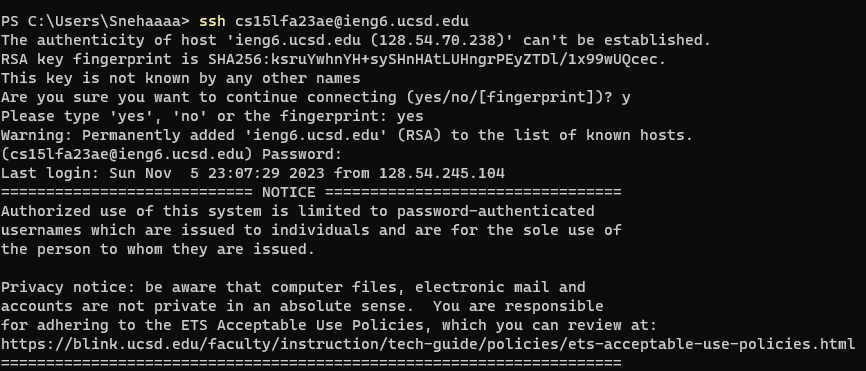
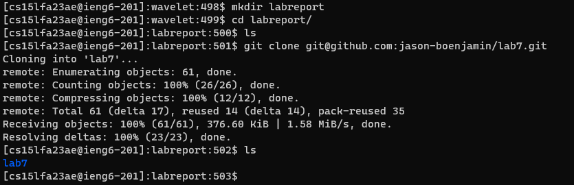
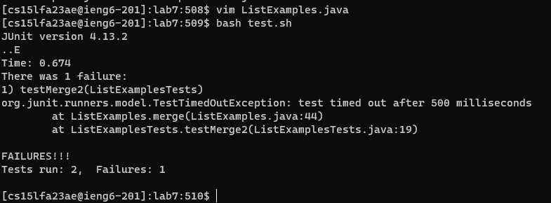
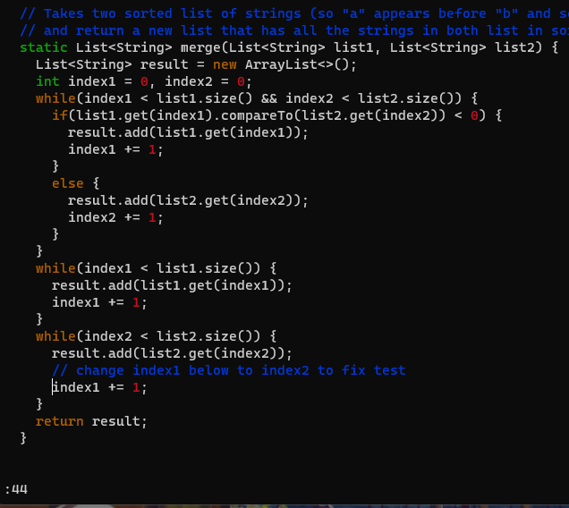
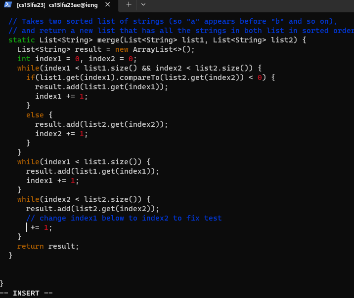
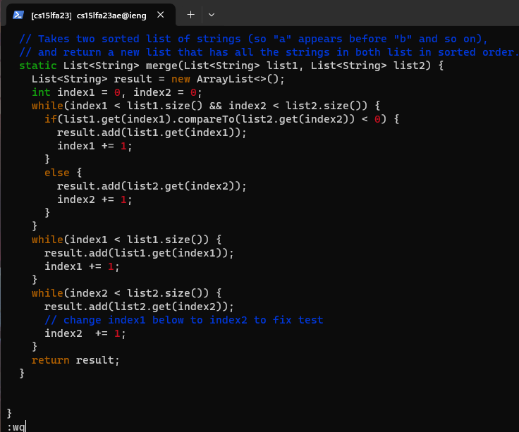
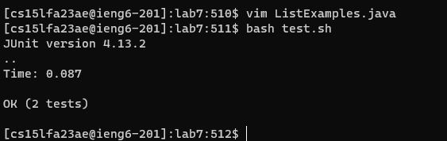
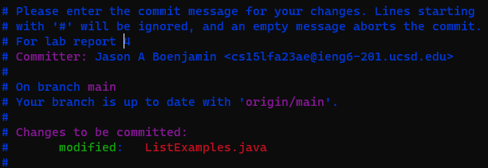
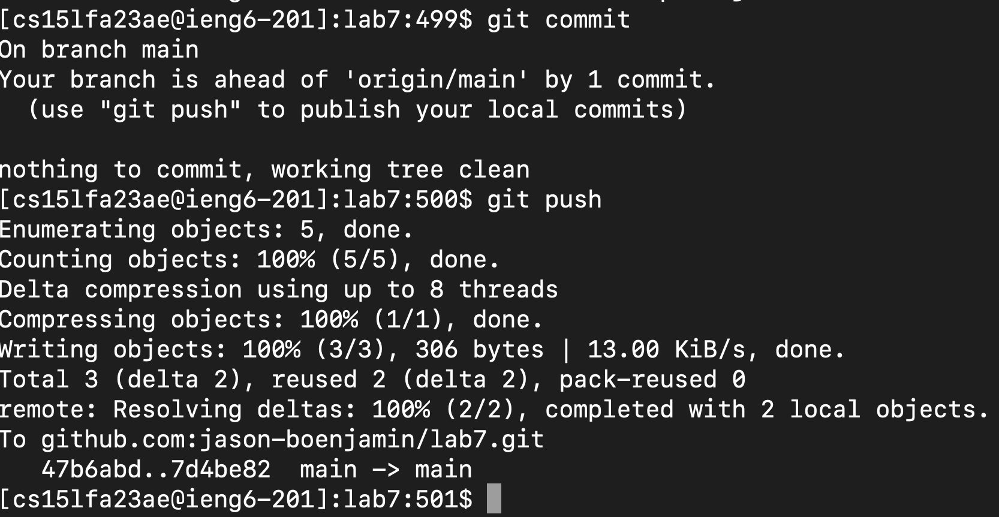

# Lab Report 4
## By Jason Boenjamin
### VIM

Steps 4 - 9

4 Log into ieng6

- I sshed into my ieng6 account by manually typing in `ssh<space>cs15lfa23ae@ieng6.ucsd.edu` then `<enter>` This prompted me with my password login since I was on a different device at the time. I will not specify the key commands I pressed but I will replace it with `*`. I typed in `************` then `<enter>`. That command officially logged me into the ieng6 server.

5 Clone your fork of the repository from your Github account

- I made a temporary directory for this lab by typing in `mkdir<space>labreport` then `<enter>`. I did this because I wanted to follow my own steps from the shared Google Docs so that I can authentically replicate my commands.
- I then used `cd<space>labre<tab>` then `<enter>` to quickly change into the labreport directory. `cd` changes my directory into the labreport directory. Additionally, pressing `<tab>` auto-filled the directory I was working fore. Note that this only works if there exists a file that contains the letters you are currently typing.
- I then typed `ls` which lists all the files in the current directory I am in. I typed this to ensure I am in the right directory with no files.
- I then used `<ctrl+c>` to copy the link for lab7.
- I then typed out `git<space>clone<space><right-click><enter>` to efficiently and effectively  `git clone` my repo. Pasting the link directly speeds up the process rather than manually typing it out. It's very cool that the terminal has this feature.
- I then typed out `ls<enter>` to see that the lab7 file was successfully cloned from the git clone command I did earlier.

6 Run the tests, demonstrating that they fail

- I used the command `vim<space>ListExamples.java<enter>` to enter virtual mode. I simply used the down arrow to look through the "ListsExamples.java" file to analyze it. Then, I pressed `<esc>:q`. Pressing escape puts me in command mode where I can (q)uit the file and go back to my terminal.
- I used the command `bash<space>tes<tab><enter>` to quickly run the test and show that they failed. Pressing `<tab>` allowed me to quickly autofill the script called "test.sh". The command runs the script and displays which tests fails.

7 Edit the code file to fix the failing test

- I typed `vim<space>ListExamples.java<enter>` to go into the file using "vim"
- I pressed `[:44]<enter>`, since I know I am already in command mode, to go to line 44, where the error was.

- I used the command `de<enter>` which means to delete to (including) end of word.
- Then, I pressed `[i]` to go into insert mode.
- Then I typed in `index2`

- I pressed `<esc>` to enter command mode
- I typed in the command `:wq<enter>`. [w] means to save or write and [q] means to quit.

8 Run the tests, demonstrating that they now succeed

- I used the command `bash<space>te<tab><enter>` to quickly complete the command and run the tests, demonstrating that they now succeed.
    
9 Commit and push the resulting change to your Github account (you can pick any commit message!)

- I used the command `git<space>commit<enter>`, where I added my messages for my changes
- I then pressed `<down-arrow><down-arrow><down-arrow><down-arrow><down-arrow><down-arrow><down-arrow><down-arrow><down-arrow><down-arrow><down-arrow><down-arrow>` to get to the line that wasn't commented out by the "#" symbol. I then typed in my commit message: `fix bugs`
- I then pressed `<esc>` to enter command mode, followed by `:wq<enter>` to (w)rite/save the file and then (q)uit.

- Finally, I used the command `git<space>push<enter>` to push the resulting change to my Github account. I did not use `<tab>` as the command was relatively short.
