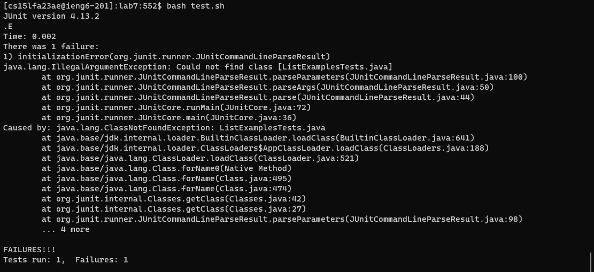

# Lab Report 5 - Putting it All Together
## Week 9
## By Jason Boenjamin

**Part 1 - Debugging Scenario**
Design a debugging scenario, and write your report as a conversation on EdStem. It should have:

The original post from a student with a screenshot showing a symptom and a description of a guess at the bug/some sense of what the failure-inducing input is. (Don’t actually make the post! Just write the content that would go in such a post)

**Student Initial EdStem Post**
Student: I have spent hours trying to debug my code for Lab 7 and the code will not compile. Attached below is the output but when I type `bash test.sh`. I don't know where to begin but I feel as though the code for my Java files and script are correct. One guess I have could be I am not initializing the right variable in my java file. I will attach them below as well. Please reach out to me as soon as possible. Thank you!

Screenshot showing  symptom
Guess at the bug

**TA Response**
Ask a leading question or suggest a command to try
Another screenshot/terminal output displaying what information the student got from trying and a clear description of what the bug is.

A response from a TA asking a leading question or suggesting a command to try (To be clear, you are mimicking a TA here.)
Another screenshot/terminal output showing what information the student got from trying that, and a clear description of what the bug is.

**NEEDED**
file and directory structure
contents of each file before fixing the bug
The full command lines I ran to trigger the bug
A description of what to edit to fix the bug

At the end, all the information needed about the setup including:
The file & directory structure needed
The contents of each file before fixing the bug
The full command line (or lines) you ran to trigger the bug
A description of what to edit to fix the bug
**NEED A JAVA AND BASHSCRIPT**
USE TERMINAL TO DESCRIBE BUG
DESIGN AN ERROR THAT PRODUCES MORE INTERESTING OUTPUT THAN A SINGLE MESSAGE ABOUT A SYNTAX OR UNBOUND IDENTIFIER ERROR

You should actually set up and run the scenario from your screenshots. It should involve at least a Java file and a bash script. Describing the bug should involve reading some output at the terminal resulting from running one or more commands. Design an error that produces more interesting output than a single message about a syntax or unbound identifier error – showcase some interesting wrong behavior! Feel free to set this up by cloning and breaking some existing code like the grading script or code from class, or by designing something of your own from scratch, etc.

**Part 2 - Reflection**
In a couple of sentences, describe something you learned from your lab experience in the second half of this quarter that you didn’t know before. 
It could be a technical topic we addressed specifically, something cool you found out on your own building on labs, something you learned from a
tutor or classmate, and so on. It doesn’t have to be specifically related to a lab writeup, we just want to hear about cool things you learned!

Reflecting on this quarter's learning journey, three standout lessons resonate with me. In the second half of this quarter, I learned how to effectively use `grep` and `find` as tools to create an autograder. Alongside learning the wild card `*` for finding all Java files, using grep to extract specific files and using JUnit to display a potential score for students was extremely intriguing to me.

Initially, the simplicity of connecting to the ieng6 server using `ssh` was a revelation for me. Previously, I faced frustrations with accessing files across my Macbook and Windows desktop. Discovering that I could effortlessly access my files from anywhere, even without my personal computer, was a game-changer. This newfound flexibility in managing my coursework was further enhanced by learning to implement my public key into the ieng6 account config files. This small but impactful skill meant I could bypass the need for a password when logging in from personal devices.

Additionally, my exposure to GitHub in this class has been transformative. My prior education at community college didn't cover GitHub, leading me to believe it was something to be self-taught. The practical guidance on navigating and utilizing GitHub for lab reports in this class was enlightening. The course made the platform approachable, making it an integral tool for my academic career. These lessons, though seemingly straightforward, have significantly enriched my technical skill set and have been instrumental in my educational growth this quarter.
