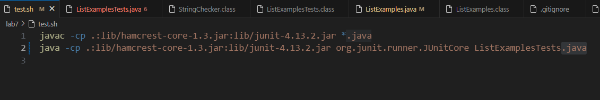
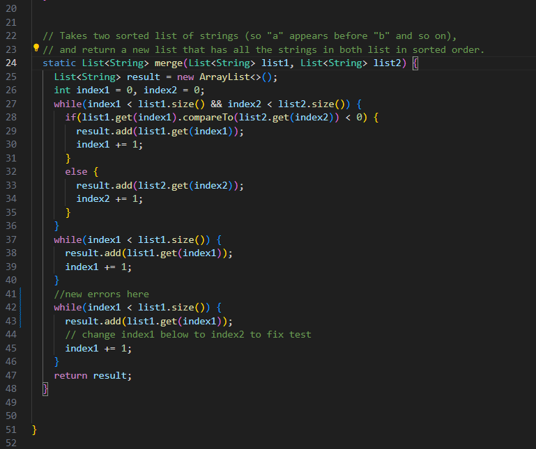
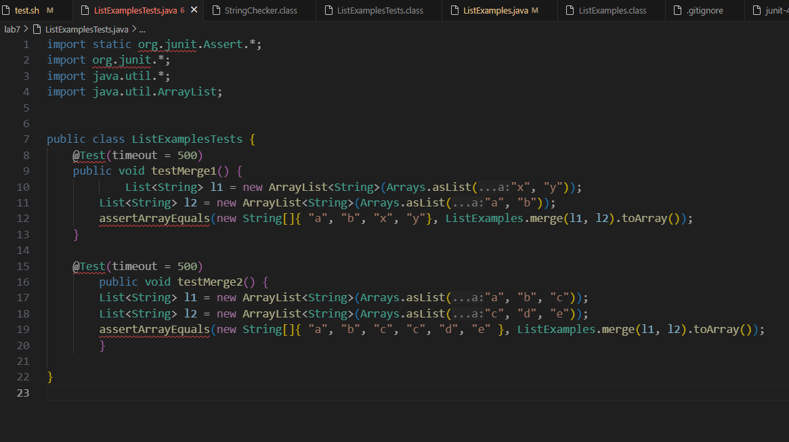

# Lab Report 5 - Putting it All Together
## Week 9
## By Jason Boenjamin

**Part 1 - Debugging Scenario**
<br>
**Student Initial EdStem Post**

<br>

Student: I have spent hours trying to debug my code for Lab 7 and the code will not compile. Attached below is the output but when I type `bash test.sh`. I don't know where to begin but I feel as though the code for my Java files and script are correct. One guess I have could be I am not initializing the right variable in my java file. I will attach them below as well. Please reach out to me as soon as possible. Thank you!


Screenshot showing  symptom

<br>
test.sh file
<br>



<br>

ListExamples.java file
<br>


<br>

ListExamplesTests.java file


<br>


**TA Response**
<br>
**TA EdStem Post**
<br>
TA: Have you tried going to the lines that Junit specifies? Also, have you looked at the terminal output when you run `bash test.sh` ? I see a line that states "`java.lang.IllegalArgumentException: Could not find class [ListExamplesTest.java]`". Once you recheck your "test.sh" file, you can utilize JDB as a way to debug your code, simply type in `javac -g ListExamples.java` followed by `jdb ListExamples`.

**Student's Response**
<br>
**Student's post**
<br>
Student:


Another screenshot/terminal output showing what information the student got from trying that, and a clear description of what the bug is.


**file and directory structure**

```
├── lab7
│   ├── lib
│   │   ├── hamcrest-core-1.3.jar
│   │   ├── lab7/lib/junit-4.13.2.jar
│   ├── ListExamples.class
│   ├── ListExamples.java
│   ├── ListExamplesTest.class
│   ├── ListExamplesTest.java
│   ├── StringChecker.class
│   ├── test.sh
```

**Contents of each file before fixing the bug**

<br>

ListExamples.java file
<br>

```
import java.util.ArrayList;
import java.util.List;

interface StringChecker { boolean checkString(String s); }

class ListExamples {

  // Returns a new list that has all the elements of the input list for which
  // the StringChecker returns true, and not the elements that return false, in
  // the same order they appeared in the input list;
  static List<String> filter(List<String> list, StringChecker sc) {
    List<String> result = new ArrayList<>();
    for(String s: list) {
      if(sc.checkString(s)) {
        result.add(0, s);
      }
    }
    return result;
  }


  // Takes two sorted list of strings (so "a" appears before "b" and so on),
  // and return a new list that has all the strings in both list in sorted order.
  static List<String> merge(List<String> list1, List<String> list2) {
    List<String> result = new ArrayList<>();
    int index1 = 0, index2 = 0;
    while(index1 < list1.size() && index2 < list2.size()) {
      if(list1.get(index1).compareTo(list2.get(index2)) < 0) {
        result.add(list1.get(index1));
        index1 += 1;
      }
      else {
        result.add(list2.get(index2));
        index2 += 1;
      }
    }
    while(index1 < list1.size()) {
      result.add(list1.get(index1));
      index1 += 1;
    }
    //new errors here
    while(index1 < list1.size()) {
      result.add(list1.get(index1));
      // change index1 below to index2 to fix test
      index1 += 1;
    }
    return result;
  }


}

```


<br>

ListExamplesTests.java file

```
import static org.junit.Assert.*;
import org.junit.*;
import java.util.*;
import java.util.ArrayList;


public class ListExamplesTests {
	@Test(timeout = 500)
	public void testMerge1() {
    		List<String> l1 = new ArrayList<String>(Arrays.asList("x", "y"));
		List<String> l2 = new ArrayList<String>(Arrays.asList("a", "b"));
		assertArrayEquals(new String[]{ "a", "b", "x", "y"}, ListExamples.merge(l1, l2).toArray());
	}
	
	@Test(timeout = 500)
        public void testMerge2() {
		List<String> l1 = new ArrayList<String>(Arrays.asList("a", "b", "c"));
		List<String> l2 = new ArrayList<String>(Arrays.asList("c", "d", "e"));
		assertArrayEquals(new String[]{ "a", "b", "c", "c", "d", "e" }, ListExamples.merge(l1, l2).toArray());
        }

}

```

<br>

<br>
test.sh file
<br>

```
javac -cp .:lib/hamcrest-core-1.3.jar:lib/junit-4.13.2.jar *.java
java -cp .:lib/hamcrest-core-1.3.jar:lib/junit-4.13.2.jar org.junit.runner.JUnitCore ListExamplesTests.java
```
<br>

**The full command lines I ran to trigger the bug**

<br>

**A description of what to edit to fix the bug**

<br>


**Part 2 - Reflection**
In a couple of sentences, describe something you learned from your lab experience in the second half of this quarter that you didn’t know before. 
It could be a technical topic we addressed specifically, something cool you found out on your own building on labs, something you learned from a
tutor or classmate, and so on. It doesn’t have to be specifically related to a lab writeup, we just want to hear about cool things you learned!


Reflecting on this quarter's learning journey, three standout lessons resonate with me. In the second half of this quarter, I learned how to effectively use `grep` and `find` as tools to create an autograder. Alongside learning the wild card `*` for finding all Java files, using grep to extract specific files and using JUnit to display a potential score for students was extremely intriguing to me.

Initially, the simplicity of connecting to the ieng6 server using `ssh` was a revelation for me. Previously, I faced frustrations with accessing files across my Macbook and Windows desktop. Discovering that I could effortlessly access my files from anywhere, even without my personal computer, was a game-changer. This newfound flexibility in managing my coursework was further enhanced by learning to implement my public key into the ieng6 account config files. This small but impactful skill meant I could bypass the need for a password when logging in from personal devices.

Additionally, my exposure to GitHub in this class has been transformative. My prior education at community college didn't cover GitHub, leading me to believe it was something to be self-taught. The practical guidance on navigating and utilizing GitHub for lab reports in this class was enlightening. The course made the platform approachable, making it an integral tool for my academic career. These lessons, though seemingly straightforward, have significantly enriched my technical skill set and have been instrumental in my educational growth this quarter.
